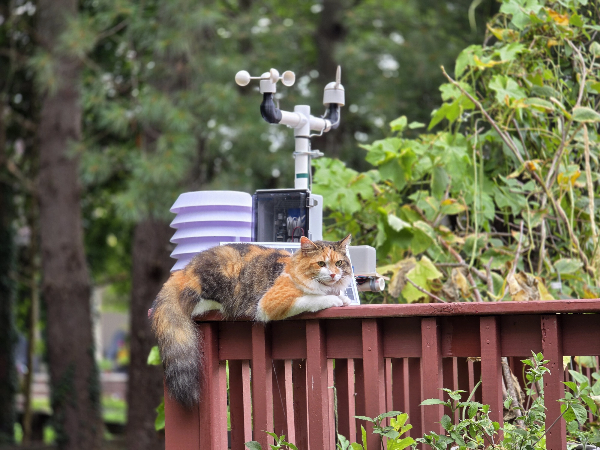

# DIY Weather Station

Uses ESP32 + SIM7080G to allow for deployment in remote areas without wifi and without needing to set up a mesh network.
Uploads data to MQTT w/ TLS support, MQTT is connected to a [WeeWX](https://github.com/weewx/weewx) backend.

# Firmware Overview

The ESP32's firmware can be found under the `firmware/` directory. It is built around the ESP-IDF framework, written in C and C++ (some tips for development exist in the DEVELOPMENT.md file). A nix flake is provided for setting up the development environment.

The system's lifecycle is as follows:

1. Power up the SIM7080G modem, and send AT commands to establish cellular link.

- In the background, power up I2C-based sensors (temperature, humidity, etc) and collect data.

2. Read the ULP's data related to wind speed, direction, and rain.
3. Format into a JSON.
4. Upload to a remote host over MQTTS.
5. Disable power for the I2C sensors.
6. Enter deep sleep, waking up at a configured interval. The ULP stays awake.

## ULP's job

The ESP32S3 comes with a single-core RISC-V ULP (Ultra Low Power) processor. To preserve battery life, the main CPU is kept asleep for as long as possible, with data collection delegated to the ULP.

The anemometer and rain gague are hooked up to interrupt that wake the ULP up. The ULP keeps count of the number of interrupts either as a sum, or as time-based buckets in an array. The ULP is also waken up by a timer, and reads the wind-vane by utilizing one of the ESP's ADCs (analog-digital converter). This data is held in the RTC-slow memory, since the RTC is always powered.

When the main CPU wakes up, it derives wind speed, direction, and rain volume from the data collected by the ULP.

See `firmware/components/argentdata/ulp/main.c` to see more related to the ULP.

# Schematic

Most sensors are attached via I2C. The full schematic is available as a kicad file under `schematic/`.

